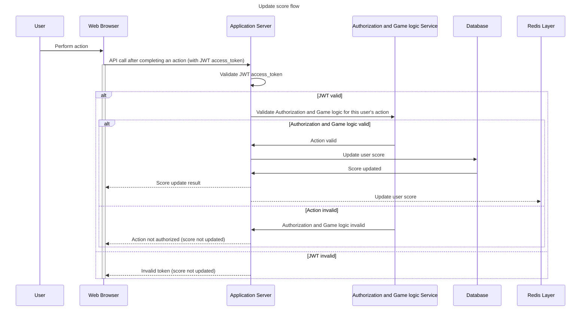
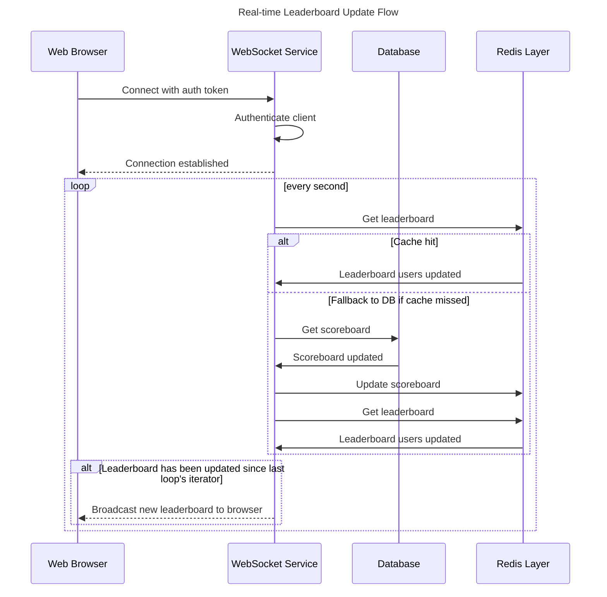

# Leaderboard API Service - Flow Diagram

### Term definition:

**Scoreboard**: The whole score board of all users.

**Leaderboard**: The score board of top 10 users.

### Real-time Leaderboard Update Flow:

## Key Flow Characteristics

### Performance Considerations
- **Caching**: Scoreboard cached in Redis sorted set
- **Database**: Optimized queries with proper indexes, like column score to get top 10 user efficiently
- **WebSocket**: Efficient broadcasting to connected clients
- **Rate Limiting**: Redis-based with sliding window

### Security Measures
- **Authentication**: JWT token verification on every request. Consider introducing a refresh token flow
- **Authorization**: User can only update their own scores and with valid action. Ensure the GameService verifies it based on server-side state, not just user claims.
- **Rate Limiting**: Add logic at the API Gateway or App Server to detect and block suspicious or automated high-frequency score update requests (e.g., user trying to exploit the endpoint).
- **Input Validation**: Sanitizes all inputs
- **Anomaly Detection**: Flags suspicious score patterns

### Scalability Features
- **Horizontal Scaling**: Stateless API design
- **Load Balancing**: Multiple API instances
- **Database Connection Pooling**: Efficient resource usage
- **Redis Pub/Sub**: Decoupled real-time updates

### Reliability Features
- **Database Transactions**: Ensures data consistency
- **Error Handling**: Comprehensive error responses
- **Logging**: Structured logging for debugging
- **Monitoring**: Real-time performance metrics (Score update latency, Suspicious activity alerts)

## API Endpoint: POST /score/update

Headers:
Authorization: Bearer <JWT>

Body:

{
  "actionType": "abc123",
  "metadata": { ... }
}

## WebSocket Channel: /ws/leaderboard

Payload Example:

{
  "event": "leaderboard:update",
  "data": [
    { "userId": "u1", "userName": "Fred", "score": 100 },
    { "userId": "u2", "userName": "John", "score": 95 },
    ...
  ]
}

## Modules & Responsibilities

### 1. Authentication Service

Validate JWTs for every score update request.

Respond with claims (user ID, expiration, role).

**Interface**

function validateToken(token: string): {
  userId: string;
  role: string;
  exp: number;
} | null

### 2. GameService

Validate that the user's action is allowed and legitimate (based on business/game logic).

Reject requests with malformed actions, invalid state transitions, or tampering attempts.

**Input Example**

{
  "userId": "user-123",
  "actionType": "abc-789",
  "metadata": {
    "level": 3,
    "timestamp": 1723852384
  }
}

**Interface**

function validateGameAction(userId: string, action: Action): {
  isValid: boolean;
  reason?: string;
  pointsAwarded?: number;
}

### 3. ScoreService

Increment the user's score in the database.

After score change, re-evaluate top 10 scores.

If top 10 changed, update Redis cache and broadcast.

### 4. Database

Stores persistent user scores.

Supports queries like: SELECT * FROM users ORDER BY score DESC LIMIT 10.

**Schema**

CREATE TABLE users (
  id UUID PRIMARY KEY,
  username VARCHAR NOT NULL,
  score INTEGER DEFAULT 0,
  updated_at TIMESTAMP
);
CREATE INDEX idx_score_desc ON users (score DESC);

### 5. Cache Layer (e.g., Redis)

Maintains the leaderboard in memory for fast access.

Uses TTLs and/or versioning to handle invalidation.

**Use a Redis Sorted Set for the leaderboard:**

ZADD leaderboard <score> <userId>

ZREVRANGE leaderboard 0 9 WITHSCORES

### 6. WebSocket Service

Maintains WebSocket connections with clients.

Pushes updated leaderboard when notified.

Secured by token/session validation on connection.

**Payload**

{
  "event": "leaderboard:update",
  "data": [
    { "userId": "u1", "username": "Alice", "score": 150 },
    { "userId": "u2", "username": "Bob", "score": 140 }
  ],
  "version": 34
}

## Inter-Service Communication

HTTP/REST between services (synchronous, easier to debug)

gRPC or message queues (Kafka/NATS/RabbitMQ) for scalability

## Testing and Monitoring Suggestions

| Component    | Metric/Log |
| -------- | ------- |
| Auth Service  | Token validation failure count    |
| GameService | Rejected actions per user    |
| ScoreService    | Score update latency    |
| WebSocket    | Connections open, messages sent/sec    |
| Redis    | Cache hit/miss rate    |
| Database    | Score write TPS, top 10 query latency    |
