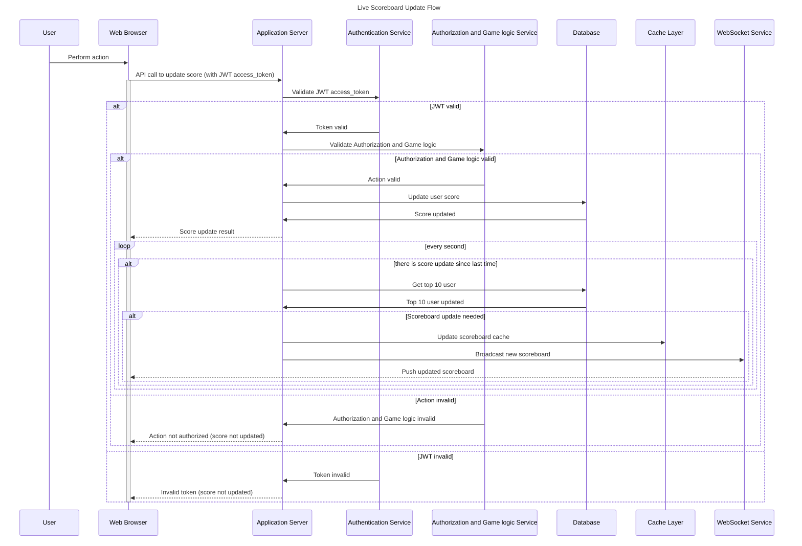

# Scoreboard API Service - Flow Diagram

## Key Flow Characteristics

### Performance Considerations
- **Caching**: Scoreboard cached in Redis
- **Database**: Optimized queries with proper indexes, like column score to get top 10 user efficiently
- **WebSocket**: Efficient broadcasting to connected clients
- **Rate Limiting**: Redis-based with sliding window

### Security Measures
- **Authentication**: JWT token verification on every request
- **Authorization**: User can only update their own scores and with valid action
- **Rate Limiting**: Prevents abuse and DoS attacks
- **Input Validation**: Sanitizes all inputs
- **Anomaly Detection**: Flags suspicious score patterns

### Scalability Features
- **Horizontal Scaling**: Stateless API design
- **Load Balancing**: Multiple API instances
- **Database Connection Pooling**: Efficient resource usage
- **Redis Pub/Sub**: Decoupled real-time updates

### Reliability Features
- **Database Transactions**: Ensures data consistency
- **Error Handling**: Comprehensive error responses
- **Logging**: Structured logging for debugging
- **Monitoring**: Real-time performance metrics 